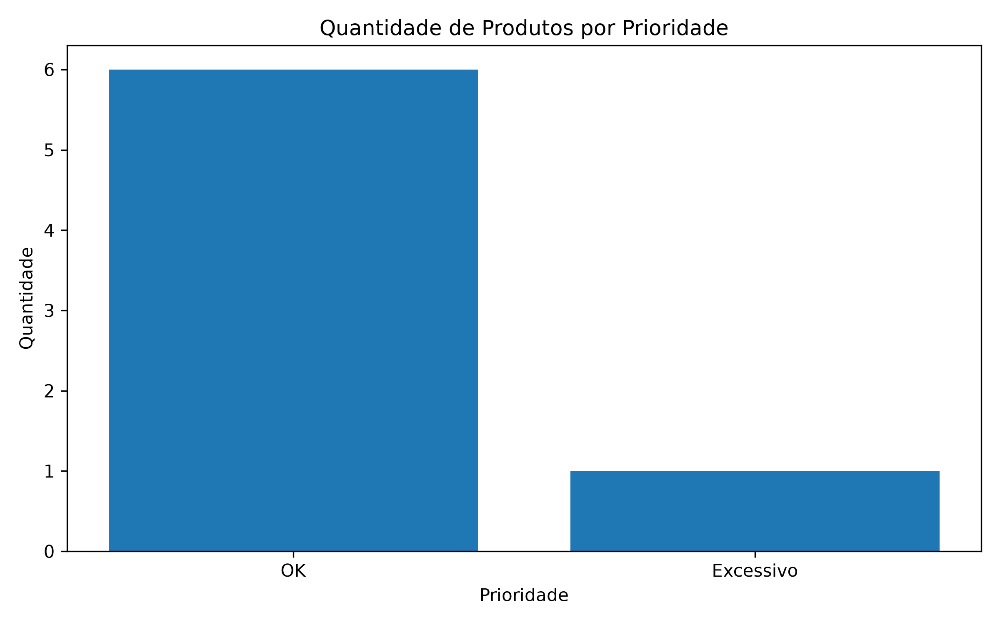
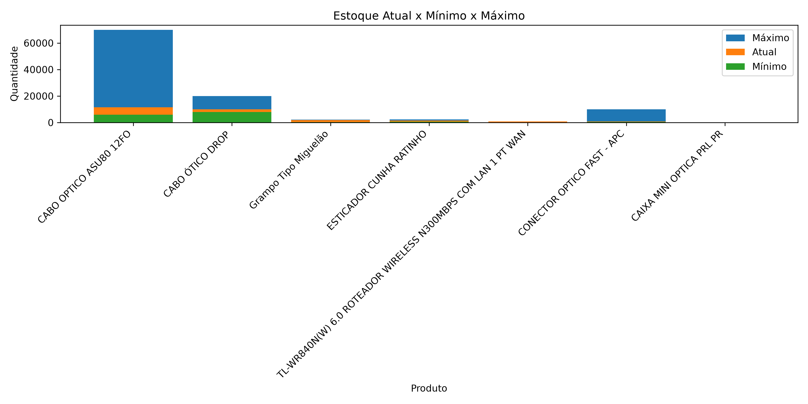
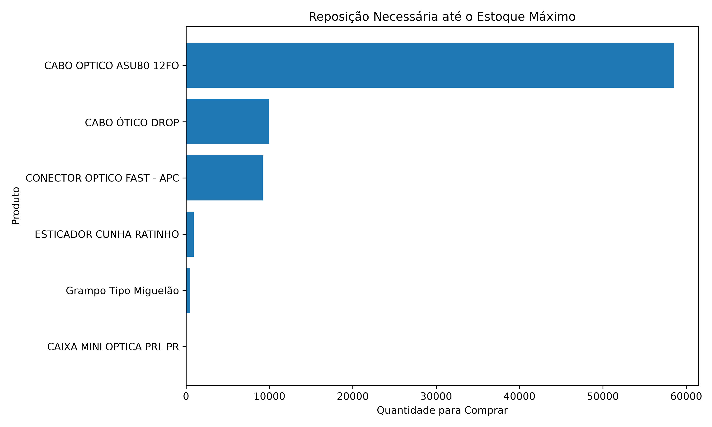

# 📦 Dashboard de Estoque por Prioridade

Projeto de análise de dados desenvolvido em Python utilizando informações anonimizadas de estoque de uma operação de telecomunicações.

O objetivo do projeto é analisar níveis de estoque, identificar produtos críticos e auxiliar na priorização de reposições.

---

## 🎯 Objetivo

Transformar dados de estoque em indicadores para apoiar decisões como:

- Identificação de materiais abaixo do estoque recomendado
- Priorização de produtos críticos
- Controle entre estoque mínimo, atual e máximo
- Planejamento de reposição de materiais

---

## 🛠️ Tecnologias utilizadas

- Python
- Pandas
- Matplotlib
- CSV como fonte de dados
- Git e GitHub

---

## 📊 Indicadores analisados

Durante o desenvolvimento foram analisados:

- Quantidade de produtos por prioridade
- Comparação entre estoque atual, mínimo e máximo
- Necessidade de reposição dos materiais
- Produtos com maior risco de falta

---

## 📈 Resultados da análise

A análise permitiu identificar materiais que precisam de maior atenção dentro da operação.

Os indicadores auxiliam em:

- Melhor controle de estoque
- Redução de falta de materiais
- Planejamento antecipado de compras
- Organização operacional do almoxarifado

---

## 📊 Visualizações geradas

#### Produtos por prioridade




#### Comparação estoque atual, mínimo e máximo




#### Reposição necessária até estoque máximo



---

## 📁 Estrutura

```
dados/
graficos/
src/
README.md
```

---

## 🚀 Melhorias futuras

- Desenvolvimento de dashboard no Power BI
- Alertas automáticos de estoque crítico
- Acompanhamento da evolução dos materiais
- Integração direta com sistema de estoque

---

## 🔒 Observação

Os dados utilizados foram anonimizados para preservar informações internas da operação.